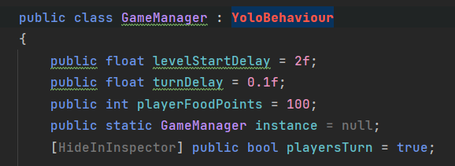
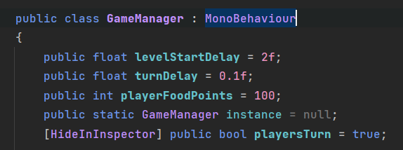

# UQAC 8PRO135 unity
8PRO135 Programmation avec des moteurs de jeu

* Matthieu GUILLEMIN GUIM18120203
* Marc DIEUDONNE DIEM18070207

## TP7 - Partie 1 : Profiler

### Problème à résoudre
#### Code à corriger :

#### Code corrigé :

### Audio
#### Profiler :

#### Code :

#### Description :
Le problème au niveau du son est que le jeu instancie 400 éléments qui sont tous démarré en même temps. Pour corriger cela il suffit de retirer la boucle.

  

### Walls

#### Code :

#### Description :
Le problème avec les murs est qu'ils sont instanciés en boucle à cause d'une coroutine récursive. Pour corriger l'erreur on retire l'appel à la coroutine car les murs s'instancient automatiquement dans le level.