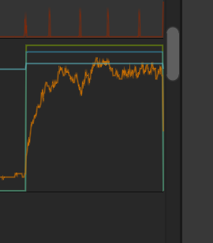
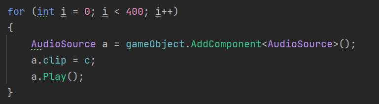
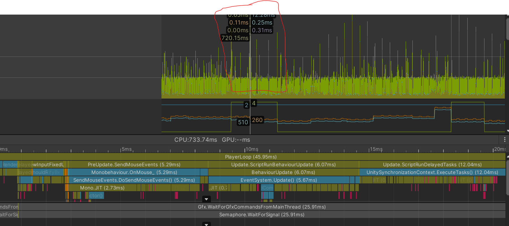
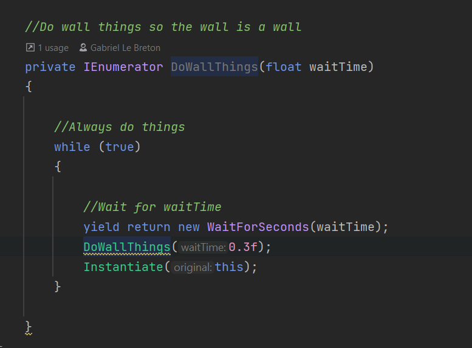

# UQAC 8PRO135 unity
8PRO135 Programmation avec des moteurs de jeu

* Matthieu GUILLEMIN GUIM18120203
* Marc DIEUDONNE DIEM18070207
* Lucas GUICHARD GUIL03100205
* Ethan PERROD PERE01090206

### TP7 - Partie 1 : Profiler
#### Audio
###### Profiler:

###### Code:

###### Description:
Le problème au niveau du son est que le jeu instancie 400 éléments qui sont tous démaré en même temps. Pour corriger cela il suffit de retirer la boucle.

  

#### Walls

###### Code:

###### Description:
Le problème avec les mure est qu'ils sont instancié en boucle à cause d'une coroutine récursive. Pour corriger l'erreur on retire l'appel à la coroutine car les mure s'instencient automatiquement dans le level.